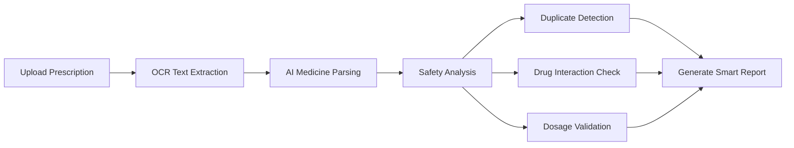

# ArogyaAI 🩺

### AI-Powered Prescription Digitizer & Medicine Safety Checker

> Making prescriptions safer, smarter, and easier to understand using AI.

---

## 📌 Overview

**ArogyaAI** is an intelligent healthcare platform that helps users digitize and analyze medical prescriptions using **OCR**, **AI-powered text extraction**, and **medicine safety analysis**.

Users can upload prescription images or PDFs, and ArogyaAI automatically extracts medicine details, detects duplicate medications, identifies missing dosage instructions, and warns about potentially harmful drug interactions.

The goal is to improve healthcare accessibility, reduce medication errors, and help patients better understand their prescriptions.

---

## ✨ Features

### 📄 Prescription Digitization

* Upload prescription images or PDF files
* Extract medicine names, dosage, and instructions using OCR + AI
* Convert handwritten/printed prescriptions into structured digital data

### 💊 Medicine Safety Analysis

* Detect duplicate medicines in prescriptions
* Identify missing dosage or timing instructions
* Highlight possible harmful drug interactions
* Improve patient awareness and medication safety

### 🤖 AI-Powered Insights

* Intelligent text parsing and medicine recognition
* Context-aware prescription understanding
* Smart validation of extracted medical information

### ⚡ Modern Tech Stack

* Fast and responsive frontend using **Next.js**
* High-performance backend powered by **FastAPI**
* AI-assisted processing for accurate extraction and analysis

---

## 🛠️ Tech Stack

| Technology        | Purpose                           |
| ----------------- | --------------------------------- |
| **Next.js**       | Frontend UI                       |
| **FastAPI**       | Backend APIs                      |
| **OCR Engine**    | Prescription text extraction      |
| **AI/NLP Models** | Medicine analysis & safety checks |
| **Python**        | Backend processing                |
| **Tailwind CSS**  | Modern UI styling                 |

---

## 🧠 How It Works



---

## 🚀 Getting Started

### 1️⃣ Clone the Repository

```bash
git clone https://github.com/your-username/arogyaai.git
cd arogyaai
```

---

### 2️⃣ Frontend Setup (Next.js)

```bash
cd frontend
npm install
npm run dev
```

Frontend runs on:

```bash
http://localhost:3000
```

---

### 3️⃣ Backend Setup (FastAPI)

```bash
cd backend
pip install -r requirements.txt
uvicorn main:app --reload
```

Backend runs on:

```bash
http://localhost:8000
```

---

## 📂 Project Structure

```bash
ArogyaAI/
│
├── frontend/          # Next.js frontend
├── backend/           # FastAPI backend
├── models/            # AI/OCR processing logic
├── uploads/           # Uploaded prescriptions
├── utils/             # Helper functions
└── README.md
```

---

## 🎯 Future Enhancements

* 🌐 Multi-language prescription support
* 🎙️ Voice-based medicine explanation
* 📱 Mobile application
* 🧬 AI health assistant integration
* ☁️ Cloud storage for prescription history
* 👨‍⚕️ Doctor & pharmacist dashboard

---

## 🔒 Disclaimer

ArogyaAI is designed for **educational and assistance purposes only** and should not replace professional medical advice, diagnosis, or treatment. Always consult qualified healthcare professionals before making medical decisions.

---

## 👨‍💻 Contributors

* Your Name
* Team Members

---

## 📜 License

This project is licensed under the **MIT License**.

---

## ⭐ Support

If you found this project helpful, consider giving it a **star ⭐** on GitHub to support development and future improvements.
